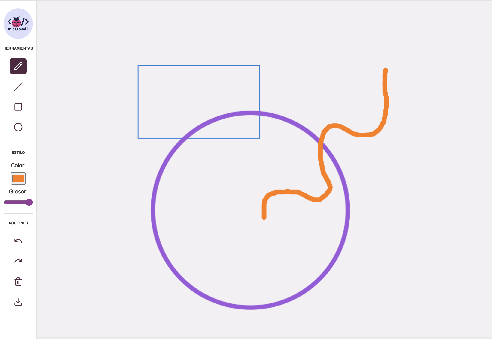

# ✏️ DrawTool

Herramienta interactiva de dibujo con React, TypeScript y SCSS. Incluye selección de herramienta (trazo libre, línea, rectángulo, círculo), ajuste de color y grosor, botones de deshacer, rehacer, limpiar y guardar, todo con una interfaz compacta y responsive.

## 🖼️ Captura



## 🚀 Tecnologías usadas

- React + TypeScript (ES6+)
- SCSS modular
- Vite
- Lucide-react (íconos)
- Canvas API

## 📁 Estructura del proyecto

```
drawtool/
├── public/
│   ├── assets/
│   │   ├── icons/
│   │   └── screenshot.png
│   ├── favicon.ico
│   ├── manifest.json
│   └── robots.txt
├── src/
│   ├── assets/
│   │   └── logo.svg
│   ├── components/
│   │   ├── Canvas/
│   │   │   └── Canvas.tsx
│   │   └── Sidebar/
│   │       ├── Sidebar.module.scss
│   │       └── Sidebar.tsx
│   ├── styles/
│   │   ├── base/
│   │   │   ├── _variables.scss
│   │   │   └── global.scss
│   │   └── components/
│   │       └── App.module.scss
│   ├── types/
│   │   └── svg.d.ts
│   ├── App.tsx
│   └── main.tsx
├── index.html
├── .editorconfig
├── .gitignore
├── .nvmrc
├── eslint.config.js
├── vite-env.d.ts
├── vite.config.ts
├── tsconfig.json
├── tsconfig.app.json
├── tsconfig.node.json
├── package.json
├── yarn.lock
└── README.md
```

## ▶️ Uso

```bash
yarn install
yarn dev
```

Abre `http://localhost:5173/drawtool` para probar la herramienta.

## 🧠 Funcionalidad

- Herramientas: trazo libre, línea, rectángulo, círculo
- Selector de color y grosor
- Acciones: deshacer, rehacer, limpiar, guardar
- Diseño responsive para desktop y mobile

---

## 👩‍💻 Autora

Una creación de [`<micazoyolli />✨`](https://nadia.dev)
