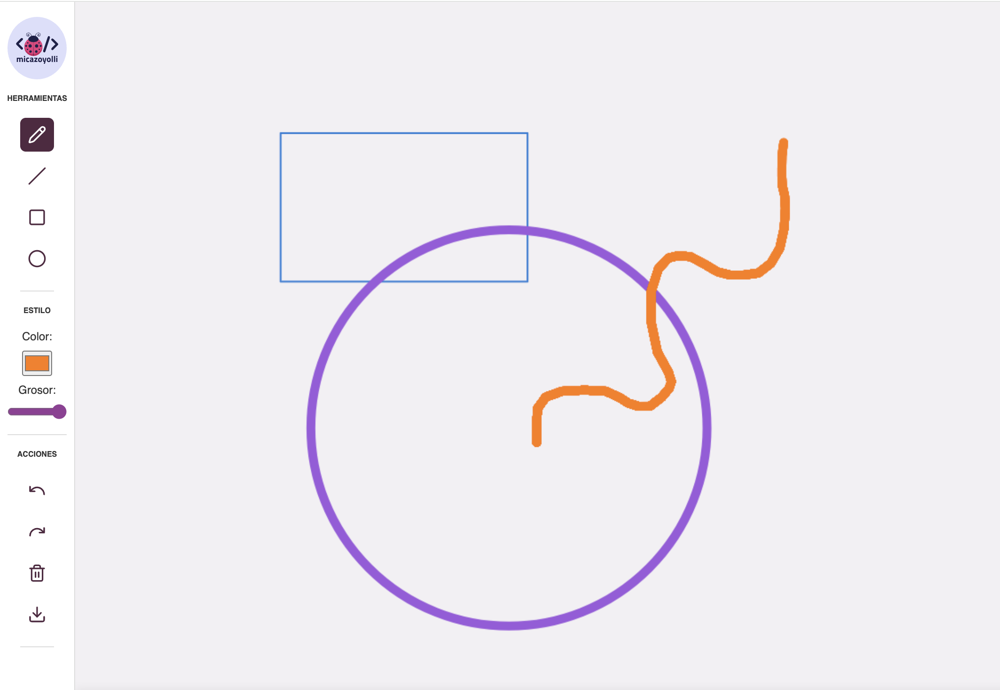

# ✏️ DrawTool

Herramienta interactiva de dibujo con selección de herramientas, color, grosor, historial de acciones y exportación de imagen.



## 🌐 Demo

[DrawTool Demo](https://micazoyolli.github.io/drawtool/)

## 🛠️ Tecnologías

- React
- TypeScript
- SCSS Modules
- Vite
- Canvas API
- Lucide React
- Node 24
- Micazoyolli Foundation para SEO/build y reduced motion

## 📦 Instalación

```bash
yarn install
```

## 🚀 Scripts

```bash
yarn dev
yarn lint
yarn typecheck
yarn build
yarn preview
yarn deploy
```

Abre `http://localhost:5173/drawtool/` para probar la herramienta en local.

## 🗂️ Estructura del proyecto

```txt
public/
scripts/
src/
├── assets/
├── components/
├── styles/
├── types/
├── App.tsx
└── main.tsx
```

## 🚢 Despliegue en GitHub Pages

Este proyecto se publica en GitHub Pages desde la rama `gh-pages`. El comando `yarn deploy` compila la aplicación, limpia archivos `.DS_Store` del build y publica `dist/` usando el CLI de Micazoyolli Foundation sin crear commits de despliegue en `main`.

La configuración `base` de Vite debe conservar la subruta del repositorio: `/drawtool/`.

## 🧠 Funcionalidad

- Herramientas de trazo libre, línea, rectángulo y círculo.
- Selector de color y grosor.
- Acciones para deshacer, rehacer, limpiar y guardar.
- Interfaz responsive para desktop y mobile.

## 🧩 Construido con Micazoyolli Foundation

Este proyecto utiliza [Micazoyolli Foundation](https://github.com/micazoyolli/foundation) como infraestructura compartida. Las mejoras de tooling, estructura y despliegue deben realizarse en Foundation para beneficiar a todos los proyectos que la consumen.

## 👩‍💻 Autora

Una creación de [`<micazoyolli />✨`](https://nadia.dev)
